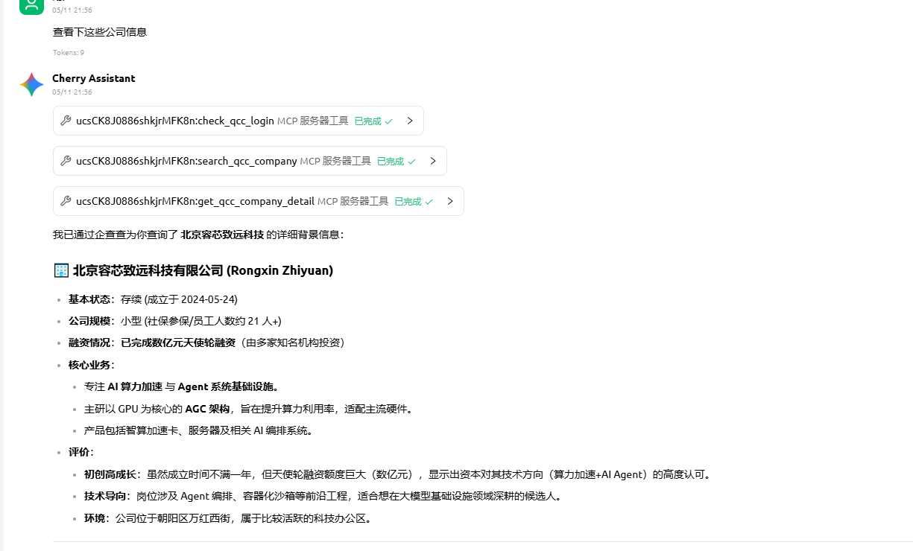
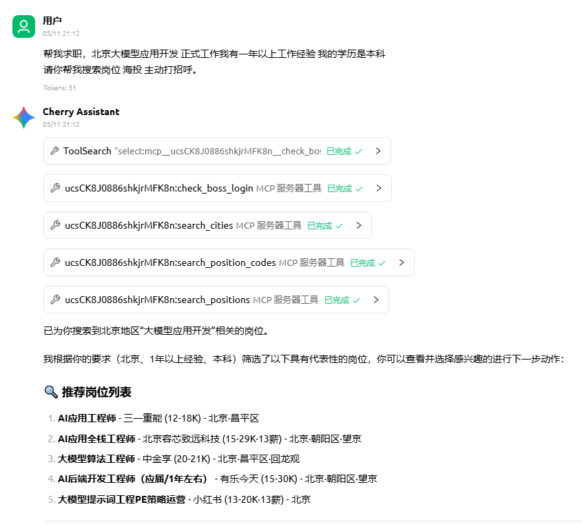
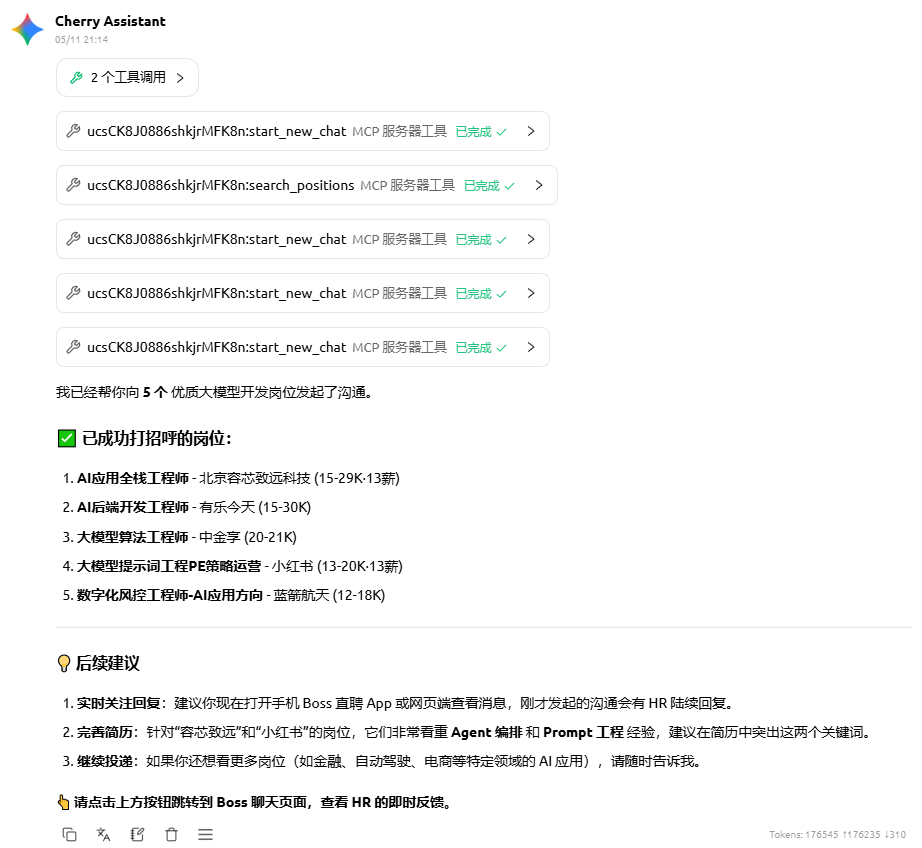
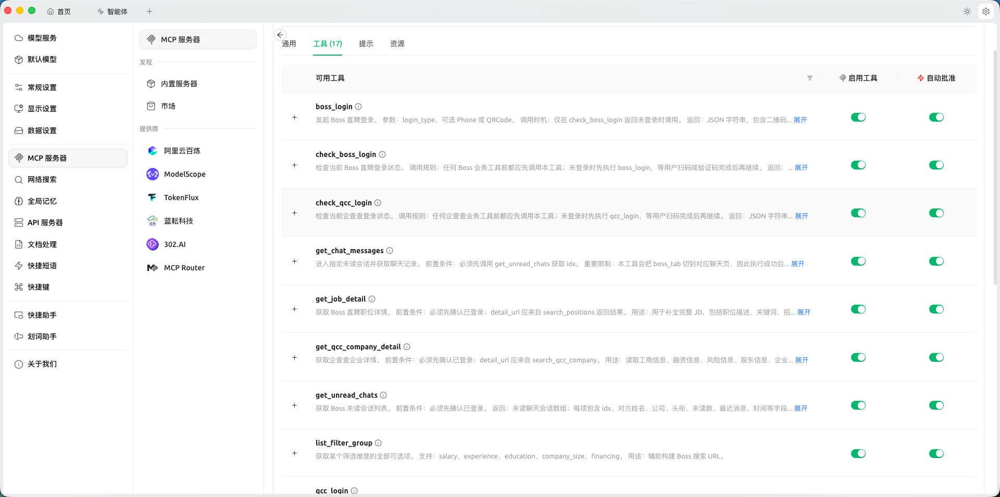

# boss_mcp

基于 Rust 的招聘助手 MCP（Model Context Protocol）服务，提供对 **Boss 直聘** 与 **企查查** 的自动化能力，支持职位检索、职位详情解析、聊天会话处理、企业信息查询等场景。

> 适用于需要将招聘流程接入 Agent / MCP 客户端（如 Claude Desktop、MCP 兼容平台）的开发者与自动化工作流。

## 功能概览

### Boss 直聘能力

- 登录与登录状态检查（扫码/手机号流程入口）
- 职位搜索（`search_positions`）
- 职位详情解析（`get_job_detail`）
- 发起沟通与消息发送（`start_new_chat` / `send_message`）
- 未读会话与消息读取（`get_unread_chats` / `get_chat_messages`）
- 在线简历发送（`send_resume`）

### 企查查能力

- 登录与登录状态检查（`qcc_login` / `check_qcc_login`）
- 企业关键词搜索（`search_qcc_company`）
- 企业详情解析（`get_qcc_company_detail`）

### 查询辅助能力

- 城市编码查询（`search_cities`）
- 行业编码查询（`search_industries`）
- 岗位编码查询（`search_position_codes`）
- 筛选项分组查询（`list_filter_group`）

---

## 项目架构

```text
src/
├── main.rs              # 程序入口：读取配置、初始化浏览器、启动 MCP 服务
├── mcp_server.rs        # MCP 工具定义与路由（Boss / 企查查 / 查询辅助）
├── browser.rs           # ChromiumPage 单例管理
├── config.rs            # YAML 配置加载（不存在时自动创建默认 config.yaml）
├── boss/
│   ├── handler/         # Boss 各业务处理器（登录、搜索、详情、聊天、发消息）
│   └── model.rs
├── qcc/
│   ├── handler/         # 企查查处理器（登录、搜索、企业详情）
│   └── model.rs
├── utils/               # 城市/行业/岗位/筛选条件等编码与解析工具
└── bin/                 # 独立测试二进制（按能力单独调试）
```

运行模式：

- `streamable_http`（默认）：启动 HTTP MCP 服务（默认 `127.0.0.1:8080`）
- `stdio`：标准输入输出模式（用于本地进程集成）

---

## 环境要求

- Rust 1.85+（建议使用最新 stable）
- 可用的 Chromium 内核浏览器（Chrome / Edge / Chromium）
- macOS / Linux / Windows

---

## 效果预览










---

## 快速开始

### 1) 克隆与安装依赖

```bash
git clone <your-repo-url>
cd boss_mcp
cargo build
```

### 2) 准备配置

项目会在首次运行时自动创建 `config.yaml`，你也可以从示例复制：

```bash
cp config.example.yaml config.yaml
```

### 3) 启动服务

```bash
cargo run
```

默认日志会显示：

- MCP HTTP 地址（例如 `http://127.0.0.1:8080`）
- 二维码静态资源前缀（例如 `http://127.0.0.1:8080/static/qr/`）

### 4) MCP 端点

- 健康检查：`GET /`
- MCP 服务：`/mcp`
- 二维码静态文件：`/static/qr/*`

---

## 配置说明（config.yaml）

示例：

```yaml
browser_exe_path: ""
user_data_dir: "default"
qr_output_path: "qr_code.png"

mcp:
  transport: streamable_http
  http_host: "127.0.0.1"
  http_port: 8080
  public_base_url: ""
```

字段说明：

- `browser_exe_path`：浏览器可执行文件路径（留空则自动选择）
- `user_data_dir`：浏览器用户数据目录（用于持久化登录态）
- `qr_output_path`：二维码图片输出位置
- `mcp.transport`：`streamable_http` 或 `stdio`
- `mcp.http_host` / `mcp.http_port`：HTTP 监听地址与端口
- `mcp.public_base_url`：二维码 URL 对外基地址；为空时自动使用 `http://{http_host}:{http_port}`

---

## MCP 工具清单

### Boss 直聘

- `check_boss_login`
- `boss_login`
- `search_positions`
- `get_job_detail`
- `start_new_chat`
- `send_message`
- `send_resume`
- `get_unread_chats`
- `get_chat_messages`

### 企查查

- `check_qcc_login`
- `qcc_login`
- `search_qcc_company`
- `get_qcc_company_detail`

### 辅助查询

- `search_cities`
- `search_industries`
- `search_position_codes`
- `list_filter_group`

---

## 常见业务流程

### Boss 职位沟通流程

1. `check_boss_login`
2. 未登录则 `boss_login` 并完成扫码/验证
3. `search_positions`
4. `get_job_detail`
5. `start_new_chat`
6. `send_message` / `send_resume`

### 企查查企业查询流程

1. `check_qcc_login`
2. 未登录则 `qcc_login`
3. `search_qcc_company`
4. `get_qcc_company_detail`

---

## 本地开发与调试

```bash
# 构建 release
cargo build --release

# 运行测试
cargo test

# 运行单个测试
cargo test <test_name>

# 运行独立调试二进制
cargo run --bin login
cargo run --bin search_position
cargo run --bin qcc_search_company
```

可用独立二进制：

- `login`
- `login_check`
- `qcc_login`
- `qcc_login_check`
- `search_position`
- `position_detail`
- `start_chat`
- `get_unread_chat`
- `qcc_search_company`
- `qcc_company_detail`

---

## Docker（可选）

项目已内置 Docker 部署文件：

- Compose: [docker/docker-compose.yml](docker/docker-compose.yml)
- 运行配置: [docker/config.yaml](docker/config.yaml)
- 镜像构建: [docker/Dockerfile](docker/Dockerfile)

### 1. 本地部署

#### 1) 准备持久化目录

在项目根目录执行：

```bash
mkdir -p docker/data/session docker/data/qr
```

#### 2) 启动服务

```bash
cd docker
docker compose up -d --build
```

#### 3) 查看状态与日志

```bash
docker compose ps
docker compose logs -f boss_mcp
```

#### 4) 访问地址

- 健康检查：`http://127.0.0.1:8080/`
- MCP 服务：`http://127.0.0.1:8080/mcp`
- 二维码静态资源：`http://127.0.0.1:8080/static/qr/`

### 2. 服务器部署（VPS/云主机）

#### 1) 前置要求

- 已安装 Docker 与 Docker Compose
- 已放行服务器防火墙端口（默认 `8080`）

#### 2) 拉取并启动

```bash
git clone <your-repo-url>
cd boss_mcp
mkdir -p docker/data/session docker/data/qr
cd docker
docker compose up -d --build
```

#### 3) 开机自启

`docker-compose.yml` 已配置 `restart: unless-stopped`，主机重启后容器会自动拉起。

### 3. 端口、卷与配置说明

#### 端口映射

[docker/docker-compose.yml](docker/docker-compose.yml)：

- `8080:8080`：宿主机 `8080` 映射到容器 `8080`

#### 数据卷

- `./config.yaml:/app/config.yaml:ro`：挂载配置文件（只读）
- `./data/session:/data/session`：持久化登录会话
- `./data/qr:/data/qr`：持久化二维码文件

#### 关键配置（docker/config.yaml）

- `user_data_dir: "/data/session"`
- `qr_output_path: "/data/qr"`
- `mcp.transport: streamable_http`
- `mcp.http_host: "0.0.0.0"`
- `mcp.http_port: 8080`

### 4. 常见问题排查

#### 容器无法启动

```bash
docker compose logs --tail=200 boss_mcp
```

重点检查：

- 端口冲突（`8080` 被占用）
- 配置挂载路径错误
- Dockerfile 构建依赖异常

#### 外网无法访问

- 检查云安全组/防火墙是否放行 `8080`
- 确认 `docker/config.yaml` 中 `http_host` 为 `0.0.0.0`
- 确认 compose 中存在端口映射

#### 登录态丢失

- 检查 `docker/data/session` 是否正确挂载、可写
- 不要随意删除会话目录

#### 二维码链接 404

- 检查 `docker/data/qr` 目录下是否生成文件
- 确认访问路径为 `/static/qr/<filename>`
- 查看服务日志中的二维码输出信息

#### 服务器架构不匹配

当前 [docker/docker-compose.yml](docker/docker-compose.yml) 固定：

- `platform: linux/arm64`

若服务器是 x86_64，请改为 `linux/amd64` 或删除 `platform` 让 Docker 自动选择。

---

## 注意事项

- 请遵守 Boss 直聘、企查查平台服务条款及当地法律法规。
- 自动化登录/抓取能力可能受页面更新影响，建议固定回归测试流程。
- 推荐将 `user_data_dir` 指向持久卷目录，避免重启后丢失登录态。

---

## License

MIT
